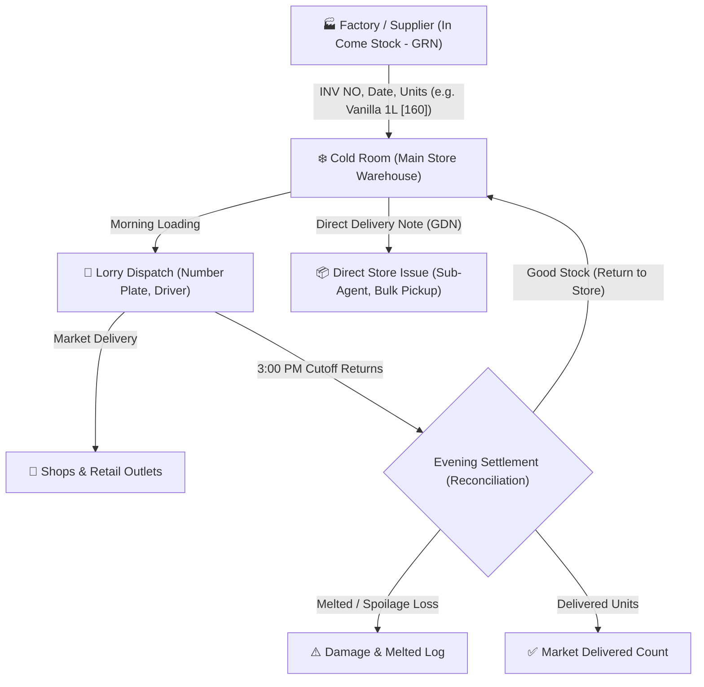

# FrostyFlow - Ice Cream Distribution & Stock Management System
### පිරිසිදු තොග පාලන පද්ධතිය (Pure Inventory & Stock Distribution &bull; Zero Money / Units Only)

A specialized web application designed specifically for Ice Cream Distribution Centers, Cold Room Warehouses, Lorry Route Logistics, and Direct Store Dispatches. Built to track **pure unit quantities only** without any financial/cash interference, directly matching the user's operational workflow sketch.

---

## 🍦 Operational Flow (ක්‍රියාකාරී සැකැස්ම)

$$\textbf{Daily Balance Formula:}$$
$$\text{Opening Units} + \text{In Come Stock (GRN)} - \text{Dispatched to Lorries} - \text{Direct Store Out (GDN)} + \text{3PM Lorry Returns} = \text{Closing Units}$$

$$\textbf{Lorry Settlement Formula:}$$
$$\text{Loaded Units} = \text{Returned to Store Units} + \text{Damaged / Melted Units} + \text{Delivered Units}$$

---

## 🚀 Key Modules (ප්‍රධාන කොටස්)

1. **Dashboard Overview (`dashboard.php`)**
   - Cold Room Real-time Stock Balance (Units)
   - Units Distributed Today
   - Evening 3:00 PM Returns Credited to Store
   - Damaged & Melted Loss Log
   - Active Lorry Status Tracker (Available vs On Route)

2. **Stock & Warehouse (`stock.php`)**
   - **In Come Stock (GRN)**: Record incoming stock with `INV NO`, `Date`, `Supplier`, line items and batch/expiry. Automatically increments Cold Room balance.
   - **Product Catalog**: Add products by SKU, Name, Flavor, Size, and Low Stock Alert threshold (Zero prices).
   - **Quick Adjustment**: Adjust stock with recorded audit reasons.

3. **Lorry Dispatch & 3:00 PM Returns (`lorry.php`)**
   - **Morning Dispatch**: Select vehicle plate number (e.g., `WP CAB-4521`), driver, and units to load from Cold Room. Automatically deducts units from Cold Room stock.
   - **Evening 3:00 PM Settlement**: Enter units returned in good condition (automatically returned to Cold Room) and damaged/melted units. Computes total delivered units.

4. **Direct Store Issue (Store Out / GDN) (`direct_issue.php`)**
   - Issue stock directly from the Cold Room to sub-agents, events, or bulk pickups.
   - Deducts items immediately from Cold Room balance.
   - Generates printable **Goods Dispatch Note (GDN)** with signature slots.

5. **Daily Stock Movement Sheet (`reports.php`)**
   - Complete itemized balance sheet for any selected date or month:
     $$\text{GRN In} - \text{Lorry Out} - \text{Direct Out} + \text{3PM Returns} = \text{Cold Room Balance}$$
   - Lorry Fleet Dispatches Ledger.
   - Direct Store Outflows Ledger.
   - Melted & Spoilage Damage Audit Log.

6. **System Settings & Data Reset (`settings.php`)**
   - **Delete EVERYTHING (0 Items)**: 1-Click complete wipe for resetting the system fresh.
   - **Clear Dispatches & Reset Stock (0)**: Keeps product catalog names while clearing all movement transactions.
   - **Restore Demo Products**: Re-seeds 10 sample ice creams (Vanilla 1L, etc.) whenever requested.

---

## 🔑 Default Super Admin Login

- **Username**: `admin`
- **Password**: `admin123`
- *(Retained safely even across full system resets)*

---

## 💻 Tech Stack
- **Backend**: PHP 8.x + MySQL / MariaDB (PDO)
- **Frontend**: Tailwind CSS, Font Awesome 6, Vanilla JS
- **Design**: 100% Mobile responsive with drawer navigation
